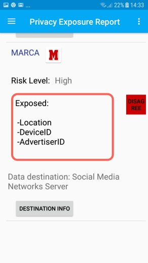
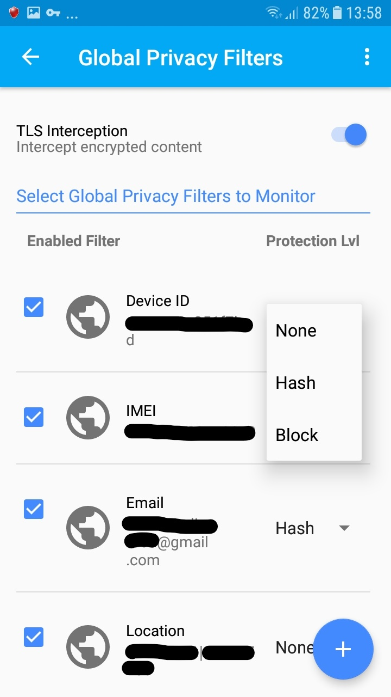

# AntMonitor-Federated-app
Here is the app code of the AntMonitor Federated privacy assistant Android app.

#  How it works:

### App report:

### Real time conexions:

### Block any personal data:

  
  

### References: 

 (1)[AntMonitor 2016](https://athinagroup.eng.uci.edu/projects/antmonitor/)

